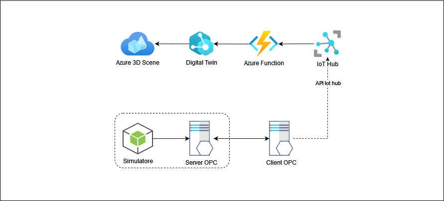
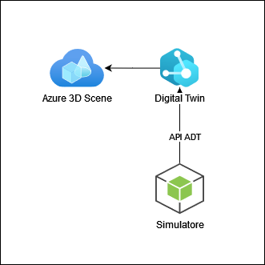

# Progetto di Industrial Informatics :cloud: :factory: :mechanical_arm:

Questo progetto è stato sviluppato come parte del corso Magistrale di Ingegneria Informatica LM-32 del DIEEI Unict (A.A. 2022/2023).

Il progetto propone una soluzione end-to-end di uno scenario Industrial Iot, utilizzando il protocollo OPCUA, Azure IoT Hub e Azure Digital Twin.

## Descrizione dei moduli

### Simulatore :wrench:
Il modulo del simulatore è responsabile della generazione di variabili pseudocasuali che rappresentano i parametri della caldaia Benson a vapore e un Generatore Elettrico. Questo modulo è scritto in Node.js e utilizza un algoritmo per generare valori casuali di una caldaia a vapore.

### Server OPC UA :desktop_computer:
Il modulo del server OPC UA legge le variabili generate dal simulatore attraverso chiamate HTTP REST e aggiorna automaticamente lo spazio degli indirizzi (address space) del server OPC UA. Questo modulo è scritto in Node.js e utilizza librerie specifiche per la comunicazione OPC UA e per la gestione delle chiamate HTTP REST.

### Client OPC UA :desktop_computer:
Il modulo del client OPC UA si occupa di effettuare delle sottoscrizioni (subscriptions) per ogni nodo di interesse nel server OPC UA e invia i dati corrispondenti al servizio Azure IoT Hub. Questo modulo è scritto in Node.js e utilizza librerie specifiche per la comunicazione OPC UA e per l'invio dei dati ad Azure IoT Hub.

### Azure Function :zap:
La Azure Function viene attivata ogni volta che vi sono nuovi messaggi provenienti da Azure IoT Hub. La funzione si occupa di aggiornare l'istanza digital twin associata alla caldaia Benson a vapore. La funzione è collegata ad un topic MQTT di Azure Event Grid, ed utilizza le librerie specifiche di Azure Digital Twin per l'aggiornamento del gemello digitale.

### Digital Twin :robot:
Il progetto include anche un modello Digital Twin definito in DTDL (Digital Twins Definition Language), che rappresenta la caldaia Benson e un Generatore Elettrico. Il Digital Twin viene aggiornato in tempo reale con i dati provenienti dal server OPC UA tramite Azure IoT Hub. Questo modello permette di monitorare e visualizzare lo stato della caldaia in modo interattivo e intuitivo. 

### Azure 3D Scenes :ice_cube:
Per arricchire l'esperienza di visualizzazione del modello Digital Twin, il progetto utilizza Azure 3D Scenes. Azure 3D Scenes è un servizio di Azure che consente di creare scenari 3D interattivi basati su modelli e dati in tempo reale. Nel contesto di questo progetto, Azure 3D Scenes viene utilizzato per visualizzare la caldaia Benson a vapore in un ambiente tridimensionale, consentendo agli utenti di esplorarla e osservarne i cambiamenti nel tempo.

Attraverso l'integrazione tra il modello Digital Twin e Azure 3D Scenes, è possibile ottenere una rappresentazione visiva realistica e dinamica della caldaia, migliorando la comprensione dei dati e facilitando l'analisi delle prestazioni e degli eventuali problemi.

### Demo

## Prerequisiti
Occorre configurare correttamente il proprio gruppo di risorse su Azure per avviare correttamente il flusso di dati e osservare gli aggiornamenti automatici nell'istanza digital twin e nella scena 3D su Azure.

In particolare bisogna:
1. Configurare correttamente Azure IoT Hub creando i devices interessati
2. Creare uno Storage Account
3. Pubblicare la Azure Function su un'istanza Azure Function App
4. Creare un topic Event Grid e il trigger di attivazione per la Azure Function
5. Pubblicare l'istanza digital twin
6. Caricare il modello 3D
7. Configurare oppurtuni Behaviour sulla scena 3Ds

Nella repository si trovano gli assett statici necessari

## Utilizzo
Per utilizzare questo progetto, è necessario seguire i seguenti passaggi:

1. Installare Node.js sul proprio sistema.
2. Clonare questo repository sul proprio computer.
3. Eseguire `install.bat` per installare le dipendenze necessarie.
4. Avviare il progetto eseguendo `start.bat`

Si prega di notare che è necessario configurare correttamente tutte le dipendenze e le credenziali per far funzionare correttamente il progetto.

## Versione Semplificata
E' possibile utilizzare una versione minimale del progetto, che esclude gran parte dei moduli, come ad esempio i moduli OPCUA e IoT Hub.

In tal caso bisogna impostare `UPDATE_DT=false` nel simulatore, per inviare direttamente i dati al Digital Twin.

### Demo

## Licenza
Questo progetto è concesso in licenza ai sensi della licenza [MIT](https://opensource.org/licenses/MIT). Fare riferimento al file LICENSE per ulteriori informazioni.

## Autori

- [Salvatore Russo](https://github.com/salvorusso) :technologist:
- [Placido Papotto](https://github.com/Papotto97) :technologist: